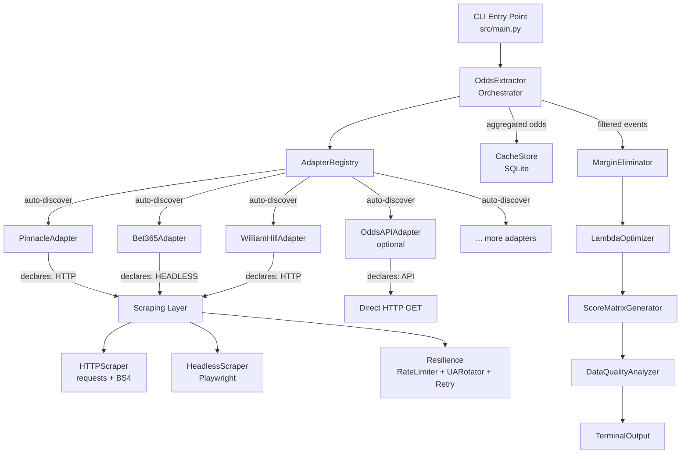
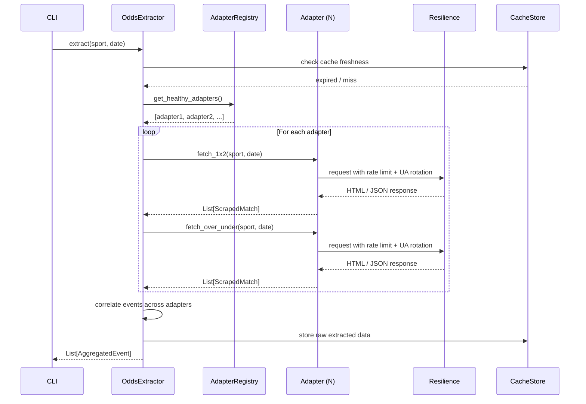

# Design Document

## Overview

This design describes the pluggable adapter architecture that replaces the single-source Odds API approach with a multi-source web scraping extraction layer. The existing math pipeline (MarginEliminator → LambdaOptimizer → ScoreMatrixGenerator → DataQualityAnalyzer → TerminalOutput) remains unchanged.

The new extraction layer introduces:
- An abstract `OddsAdapter` base class defining the contract all bookmaker sources implement
- An `AdapterRegistry` that auto-discovers adapter files at startup
- HTTP scraping utilities (requests + BeautifulSoup) for server-rendered pages
- An optional Playwright headless browser fallback for JS-heavy sites
- Resilience primitives: rate limiting, user-agent rotation, retry with backoff
- A rewritten `OddsExtractor` that orchestrates adapters instead of calling a single API

The Odds API remains as one adapter among many (optional, activated by environment variable), rather than the sole data source.

## Architecture



### Extraction Flow (Sequence)



## Components and Interfaces

### 1. Abstract Base Class — `src/adapters/base.py`

```python
from __future__ import annotations
from abc import ABC, abstractmethod
from dataclasses import dataclass, field
from enum import Enum
from datetime import datetime


class ExtractionMethod(Enum):
    """Declares how an adapter fetches data."""
    HTTP = "http"
    HEADLESS = "headless"
    API = "api"


class AdapterHealth(Enum):
    """Health status of an adapter."""
    REACHABLE = "reachable"
    UNREACHABLE = "unreachable"
    RATE_LIMITED = "rate_limited"
    DEGRADED = "degraded"


@dataclass
class MarketOutcome:
    """A single outcome in a betting market."""
    name: str           # "Home", "Draw", "Away", "Over", "Under"
    odds: float         # decimal odds
    point: float | None = None  # e.g. 2.5 for over/under


@dataclass
class ScrapedMatch:
    """Standardized match data returned by any adapter."""
    home_team: str
    away_team: str
    event_timestamp: datetime
    market_type: str         # "1x2" or "over_under"
    outcomes: list[MarketOutcome] = field(default_factory=list)


class OddsAdapter(ABC):
    """Abstract base class for all bookmaker data extraction adapters."""

    @property
    @abstractmethod
    def bookmaker_id(self) -> str:
        """Unique identifier for this bookmaker (e.g., 'pinnacle')."""
        ...

    @property
    @abstractmethod
    def bookmaker_name(self) -> str:
        """Human-readable name (e.g., 'Pinnacle Sports')."""
        ...

    @property
    @abstractmethod
    def priority(self) -> int:
        """Priority level. Lower number = higher priority."""
        ...

    @property
    @abstractmethod
    def extraction_method(self) -> ExtractionMethod:
        """Declares whether this adapter uses HTTP, headless, or API."""
        ...

    @property
    @abstractmethod
    def base_url(self) -> str:
        """Root URL for the bookmaker site."""
        ...

    @abstractmethod
    def fetch_1x2(self, sport: str, date: str | None = None) -> list[ScrapedMatch]:
        """Fetch 1X2 (match winner) odds.

        Args:
            sport: Sport/league key (e.g., 'soccer_epl').
            date: Optional YYYY-MM-DD date filter.

        Returns:
            List of ScrapedMatch with market_type='1x2'.

        Raises:
            OddsExtractionError: On unrecoverable extraction failure.
        """
        ...

    @abstractmethod
    def fetch_over_under(self, sport: str, date: str | None = None) -> list[ScrapedMatch]:
        """Fetch Over/Under 2.5 goals odds.

        Args:
            sport: Sport/league key (e.g., 'soccer_epl').
            date: Optional YYYY-MM-DD date filter.

        Returns:
            List of ScrapedMatch with market_type='over_under'.

        Raises:
            OddsExtractionError: On unrecoverable extraction failure.
        """
        ...

    @abstractmethod
    def health_check(self) -> AdapterHealth:
        """Report current adapter health (reachable, rate-limited, etc.)."""
        ...
```

### 2. Adapter Registry — `src/adapters/registry.py`

```python
from __future__ import annotations
import importlib
import pkgutil
from pathlib import Path

from src.adapters.base import OddsAdapter, AdapterHealth


class AdapterRegistry:
    """Auto-discovers and manages OddsAdapter implementations."""

    def __init__(self) -> None:
        self._adapters: dict[str, OddsAdapter] = {}
        self._consecutive_failures: dict[str, int] = {}

    def discover(self) -> None:
        """Scan the adapters package and instantiate all OddsAdapter subclasses."""
        ...

    def get_all(self) -> list[OddsAdapter]:
        """Return all registered adapters sorted by priority (ascending)."""
        ...

    def get_healthy(self) -> list[OddsAdapter]:
        """Return only adapters with health == REACHABLE, sorted by priority."""
        ...

    def list_with_status(self) -> list[dict[str, str]]:
        """Return adapter info dicts with id, name, health status."""
        ...

    def record_failure(self, adapter_id: str) -> None:
        """Increment consecutive failure count. Mark DEGRADED at 3."""
        ...

    def record_success(self, adapter_id: str) -> None:
        """Reset consecutive failure count for the adapter."""
        ...
```

### 3. HTTP Scraper — `src/scraping/http_scraper.py`

```python
from __future__ import annotations
from bs4 import BeautifulSoup


class HTTPScraper:
    """HTTP-based extraction using requests + BeautifulSoup."""

    def __init__(self, resilience: ResilienceConfig) -> None:
        """Initialize with resilience configuration (rate limiter, UA pool)."""
        ...

    def fetch_page(self, url: str, domain: str) -> BeautifulSoup:
        """Fetch a URL respecting rate limits and UA rotation.

        Args:
            url: Full URL to fetch.
            domain: Domain key for rate limiting.

        Returns:
            Parsed BeautifulSoup document.

        Raises:
            OddsExtractionError: On timeout, HTTP error after retries.
        """
        ...

    def extract_by_css(self, soup: BeautifulSoup, selectors: dict[str, str]) -> list[dict]:
        """Extract elements using CSS selectors.

        Args:
            soup: Parsed HTML document.
            selectors: Mapping of field names to CSS selectors.

        Returns:
            List of extracted value dicts.
        """
        ...

    def extract_by_xpath(self, soup: BeautifulSoup, expressions: dict[str, str]) -> list[dict]:
        """Extract elements using XPath expressions (via lxml).

        Args:
            soup: Parsed HTML document.
            expressions: Mapping of field names to XPath expressions.

        Returns:
            List of extracted value dicts.
        """
        ...

    @staticmethod
    def parse_odds_value(raw: str) -> float:
        """Parse a raw odds string into decimal format.

        Handles decimal ('2.50'), fractional ('3/2'), and American ('+150', '-200').

        Args:
            raw: Raw odds text from the page.

        Returns:
            Decimal odds as float.

        Raises:
            ValueError: If the format is unrecognizable.
        """
        ...
```

### 4. Headless Browser Scraper — `src/scraping/headless.py`

```python
from __future__ import annotations


class HeadlessScraper:
    """Playwright-based headless browser extraction (optional dependency)."""

    def __init__(self, timeout: int = 60_000) -> None:
        """Initialize. Raises ImportError if playwright is not installed."""
        ...

    def fetch_rendered_page(self, url: str, wait_selector: str) -> str:
        """Load a page, wait for selector, return rendered HTML.

        Args:
            url: Page URL to load.
            wait_selector: CSS selector to wait for before extracting.

        Returns:
            Rendered HTML string.

        Raises:
            OddsExtractionError: On timeout or page load failure.
        """
        ...

    def close(self) -> None:
        """Close the shared browser instance."""
        ...
```

### 5. Resilience Layer — `src/scraping/resilience.py`

```python
from __future__ import annotations
import time
import random
from dataclasses import dataclass, field


@dataclass
class RateLimiterConfig:
    """Per-domain rate limiting configuration."""
    min_delay: float = 3.0       # seconds between requests
    max_delay: float = 30.0      # upper bound
    jitter_pct: float = 0.30     # ±30% randomization


@dataclass
class ResilienceConfig:
    """Full resilience configuration for the scraping layer."""
    rate_limiter: RateLimiterConfig = field(default_factory=RateLimiterConfig)
    max_retries: int = 3
    backoff_base: float = 2.0       # exponential backoff: 2, 4, 8 seconds
    ua_pool_size: int = 10
    proxy: str | None = None        # from env SCRAPER_PROXY


class RateLimiter:
    """Token-bucket style per-domain rate limiter with jitter."""

    def __init__(self, config: RateLimiterConfig) -> None:
        self._config = config
        self._last_request: dict[str, float] = {}

    def wait(self, domain: str) -> None:
        """Block until the domain's rate limit window has passed."""
        ...

    def _compute_delay(self) -> float:
        """Compute delay with jitter applied."""
        base = self._config.min_delay
        jitter = base * self._config.jitter_pct * random.uniform(-1, 1)
        return max(0.1, base + jitter)


class UserAgentRotator:
    """Cycles through realistic browser user-agent strings."""

    _AGENTS: list[str] = [...]  # 10+ realistic UA strings

    def __init__(self) -> None:
        self._index = 0

    def next(self) -> str:
        """Return the next user-agent string in rotation."""
        ...


class RetryHandler:
    """Exponential backoff retry logic for transient failures."""

    def __init__(self, max_retries: int = 3, backoff_base: float = 2.0) -> None:
        self._max_retries = max_retries
        self._backoff_base = backoff_base

    def execute(self, fn, *args, **kwargs):
        """Execute fn with retry on transient errors (5xx, timeout, reset).

        Retries up to max_retries times with exponential backoff.
        Respects Retry-After header on HTTP 429.

        Returns:
            Result of fn on success.

        Raises:
            OddsExtractionError: After all retries exhausted.
        """
        ...
```

### 6. Rewritten OddsExtractor — `src/odds_extractor.py`

```python
from __future__ import annotations
from src.adapters.registry import AdapterRegistry
from src.adapters.base import ScrapedMatch
from src.cache_store import CacheStore


class OddsExtractor:
    """Orchestrates adapter-based extraction, event correlation, and caching."""

    MIN_BOOKMAKERS = 3

    def __init__(
        self,
        registry: AdapterRegistry,
        cache_store: CacheStore,
        ttl_hours: int = 24,
        excluded_bookmakers: list[str] | None = None,
    ) -> None:
        ...

    def extract(
        self,
        sport: str,
        date: str | None = None,
        round_id: str | None = None,
    ) -> list[AggregatedEvent]:
        """Run full extraction across all healthy adapters.

        1. Check cache freshness
        2. Query each adapter for 1X2 and over/under markets
        3. Correlate events across adapters
        4. Enforce minimum bookmaker threshold
        5. Cache raw results
        6. Return aggregated events
        """
        ...

    def _correlate_events(
        self,
        all_matches: dict[str, list[ScrapedMatch]],
    ) -> list[AggregatedEvent]:
        """Match events across adapters using team name normalization + ±2h timestamp."""
        ...

    @staticmethod
    def normalize_team_name(name: str) -> str:
        """Normalize team name: lowercase, strip FC/CF/SC suffixes, strip whitespace."""
        ...
```

## Data Models

### New Adapter-Layer Models (additions to `src/models.py`)

```python
from __future__ import annotations
from dataclasses import dataclass, field
from datetime import datetime


@dataclass
class AggregatedEvent:
    """A single match with odds aggregated from multiple bookmaker adapters."""
    home_team: str
    away_team: str
    event_timestamp: datetime
    bookmaker_odds_1x2: dict[str, tuple[float, float, float]]
    # bookmaker_id -> (home_odds, draw_odds, away_odds)
    bookmaker_odds_over_under: dict[str, tuple[float, float]]
    # bookmaker_id -> (over_2.5_odds, under_2.5_odds)
    source_count: int  # number of distinct bookmaker sources


@dataclass
class AdapterStatus:
    """Status snapshot of a registered adapter."""
    adapter_id: str
    adapter_name: str
    priority: int
    health: str  # "reachable" | "unreachable" | "rate_limited" | "degraded"
    extraction_method: str  # "http" | "headless" | "api"
    consecutive_failures: int
```

### SQLite Schema Update

The existing `cache` table schema remains compatible. An additional `extraction_method` column is added to track how data was obtained:

```sql
ALTER TABLE cache ADD COLUMN extraction_method TEXT DEFAULT 'api';
-- Values: 'scraping_http', 'scraping_headless', 'api'
```

No other schema changes required. The existing `bookmaker_scores`, `predictions`, and `actual_results` tables work unchanged with the new adapter layer.

### Team Name Normalization Rules

| Rule | Example Input | Normalized |
|------|--------------|-----------|
| Lowercase | "Manchester United" | "manchester united" |
| Strip FC/CF/SC/AFC suffix | "Chelsea FC" | "chelsea" |
| Strip leading "FC " | "FC Barcelona" | "barcelona" |
| Collapse whitespace | "Real  Madrid" | "real madrid" |
| Strip accents (optional) | "Atlético" | "atletico" |

## Correctness Properties

*A property is a characteristic or behavior that should hold true across all valid executions of a system — essentially, a formal statement about what the system should do. Properties serve as the bridge between human-readable specifications and machine-verifiable correctness guarantees.*

### Property 1: Auto-Discovery Completeness

*For any* set of Python modules in the adapters directory that contain a class inheriting from `OddsAdapter`, the `AdapterRegistry.discover()` method SHALL register every such class, and the count of registered adapters SHALL equal the count of conforming modules.

**Validates: Requirements 1.2, 1.3**

### Property 2: Adapter Fault Isolation

*For any* set of registered adapters where a subset raises exceptions during extraction, the `OddsExtractor` SHALL return aggregated results from exactly the non-failing adapters, and no exception from one adapter SHALL prevent data from other adapters from being included.

**Validates: Requirements 1.6, 7.1**

### Property 3: Odds Format Conversion Round-Trip

*For any* valid decimal odds value `d`, converting `d` to fractional format and parsing it back SHALL produce a value within ±0.01 of `d`. Similarly, *for any* valid decimal odds value `d`, converting `d` to American format and parsing it back SHALL produce a value within ±0.01 of `d`.

**Validates: Requirements 3.7**

### Property 4: HTML Extraction Correctness

*For any* well-formed HTML document containing odds values at known CSS selector paths, the `HTTPScraper.extract_by_css()` method SHALL extract values that, when parsed, equal the embedded decimal odds values (within floating-point tolerance ±0.001).

**Validates: Requirements 3.3, 3.4, 3.6**

### Property 5: HTTP Error Surfaces Correctly

*For any* HTTP response with status code in [400, 599] or a connection timeout, the `HTTPScraper.fetch_page()` SHALL raise an `OddsExtractionError` containing the status code (or "timeout" indication), and the adapter SHALL be marked as temporarily unavailable.

**Validates: Requirements 3.5**

### Property 6: Rate Limiter Timing Invariant

*For any* sequence of N requests (N ≥ 2) to the same domain with a configured minimum delay `d`, the elapsed time between any two consecutive requests SHALL be within the range `[d * 0.7, d * 1.3]` (accounting for jitter), and SHALL never be less than `d * 0.7`.

**Validates: Requirements 5.1, 5.5**

### Property 7: User-Agent Rotation Coverage

*For any* sequence of K requests where K equals the UA pool size, the set of user-agent strings used SHALL contain all pool entries exactly once (full rotation within one cycle).

**Validates: Requirements 5.2**

### Property 8: Retry Exponential Backoff

*For any* transient error (HTTP 5xx, connection timeout, connection reset), the system SHALL retry at most 3 times, and the wait duration before retry attempt `i` (1-indexed) SHALL be `2^i` seconds (±30% jitter). After 3 failed retries, the adapter SHALL be marked temporarily unavailable.

**Validates: Requirements 5.4**

### Property 9: Degradation After Consecutive Failures

*For any* adapter, recording exactly 3 consecutive failures (without an intervening success) SHALL transition its health status to DEGRADED. Recording a success at any point SHALL reset the consecutive failure counter to 0.

**Validates: Requirements 5.6**

### Property 10: Event Correlation by Name and Timestamp

*For any* two `ScrapedMatch` objects from different adapters, they SHALL be correlated as the same event if and only if their normalized team names are equal AND their event timestamps differ by at most 2 hours (7200 seconds).

**Validates: Requirements 7.2**

### Property 11: Team Name Normalization Idempotence

*For any* team name string `s`, applying `normalize_team_name` twice SHALL produce the same result as applying it once: `normalize(normalize(s)) == normalize(s)`. Additionally, *for any* team name `s` and any suffix in {"FC", "CF", "SC", "AFC"}, `normalize(s + " " + suffix) == normalize(s)`.

**Validates: Requirements 7.4**

### Property 12: Minimum Bookmaker Threshold Enforcement

*For any* aggregated event, if the number of distinct bookmaker sources providing both 1X2 and Over/Under odds is less than 3, the event SHALL be excluded from the output. If the count is 3 or more, the event SHALL be included.

**Validates: Requirements 7.3**

### Property 13: Cache Persistence After Extraction

*For any* successful extraction run that produces aggregated events, each event's raw odds data SHALL be stored in the CacheStore, and a subsequent cache lookup with the same keys SHALL return the stored data without triggering new extraction.

**Validates: Requirements 7.5**

## Error Handling

### Error Categories and Responses

| Error Type | Source | Response | Recovery |
|-----------|--------|----------|----------|
| HTTP Timeout (30s) | HTTPScraper | Raise `OddsExtractionError` | Retry up to 3× with backoff |
| HTTP 4xx | HTTPScraper | Raise `OddsExtractionError` | Skip adapter, log error |
| HTTP 5xx | HTTPScraper | Transient error | Retry up to 3× with backoff |
| HTTP 429 | HTTPScraper | Rate limited | Wait Retry-After (or 60s default) |
| Connection Reset | HTTPScraper | Transient error | Retry up to 3× with backoff |
| Playwright Timeout (60s) | HeadlessScraper | Raise `OddsExtractionError` | Mark adapter unavailable |
| Playwright Not Installed | Import check | ImportError caught | Skip headless adapters, log warning |
| Parsing Error (invalid HTML) | HTTPScraper | Raise `OddsExtractionError` | Skip adapter |
| Odds Format Unrecognized | `parse_odds_value` | Raise `ValueError` | Skip that outcome, log |
| All Adapters Failed | OddsExtractor | Return stale cache or empty | Log critical warning |
| Cache Expired + Extraction Failed | OddsExtractor | Return stale data with warning | User sees `[STALE]` indicator |
| Adapter Degraded (3 failures) | AdapterRegistry | Mark DEGRADED | Skip in future runs, log investigation recommendation |

### Custom Exceptions

```python
class OddsExtractionError(Exception):
    """Raised when odds extraction fails (HTTP error, timeout, parsing failure)."""
    def __init__(self, message: str, status_code: int | None = None, adapter_id: str | None = None):
        self.status_code = status_code
        self.adapter_id = adapter_id
        super().__init__(message)


class AdapterDiscoveryError(Exception):
    """Raised when the adapter registry fails to scan the adapters directory."""
    pass
```

### Graceful Degradation Strategy

1. **Single adapter failure** → Skip it, continue with remaining adapters
2. **All scraping adapters fail** → Fall back to Odds API adapter (if configured)
3. **All adapters fail + cache exists** → Return stale cached data with `[STALE]` warning
4. **All adapters fail + no cache** → Exit with error message listing failed adapters
5. **Headless not installed** → Silently skip headless-only adapters, operate with HTTP-only adapters

## Testing Strategy

### Unit Tests

Unit tests cover specific examples, edge cases, and integration points:

- `test_adapter_base.py` — Verify ABC enforcement (missing methods raise TypeError)
- `test_adapter_registry.py` — Discovery with 0, 1, N adapters; health status transitions
- `test_http_scraper.py` — Parsing odds from HTML fixtures (decimal, fractional, American); CSS/XPath extraction
- `test_headless_scraper.py` — Timeout behavior; optional dependency handling
- `test_resilience.py` — Rate limiter edge cases; retry exhaustion; 429 handling
- `test_odds_extractor.py` — Event correlation; threshold filtering; cache interactions
- `test_team_normalization.py` — Specific suffix stripping, accent handling, edge cases

### Property-Based Tests (Hypothesis)

Property-based tests verify universal correctness across randomized inputs. Each test runs **minimum 100 iterations**.

| Test | Property | Tag |
|------|----------|-----|
| `test_discovery_completeness` | Property 1 | Feature: betting-odds-calculator, Property 1: Auto-discovery finds all conforming adapter modules |
| `test_fault_isolation` | Property 2 | Feature: betting-odds-calculator, Property 2: Failing adapters don't prevent successful ones from contributing |
| `test_odds_format_roundtrip` | Property 3 | Feature: betting-odds-calculator, Property 3: Decimal→fractional→decimal and decimal→american→decimal round trips preserve value |
| `test_html_extraction_correct` | Property 4 | Feature: betting-odds-calculator, Property 4: Odds embedded in HTML at configured selectors are correctly extracted |
| `test_http_error_surfaces` | Property 5 | Feature: betting-odds-calculator, Property 5: All HTTP errors produce OddsExtractionError with correct status |
| `test_rate_limiter_timing` | Property 6 | Feature: betting-odds-calculator, Property 6: Inter-request delays fall within configured bounds |
| `test_ua_rotation_coverage` | Property 7 | Feature: betting-odds-calculator, Property 7: All UA strings are used within one full cycle |
| `test_retry_backoff` | Property 8 | Feature: betting-odds-calculator, Property 8: Retries follow exponential backoff and cap at 3 |
| `test_degradation_threshold` | Property 9 | Feature: betting-odds-calculator, Property 9: 3 consecutive failures trigger DEGRADED status |
| `test_event_correlation` | Property 10 | Feature: betting-odds-calculator, Property 10: Events correlate iff normalized names match and timestamps within 2h |
| `test_normalization_idempotence` | Property 11 | Feature: betting-odds-calculator, Property 11: normalize(normalize(s)) == normalize(s) |
| `test_min_bookmaker_threshold` | Property 12 | Feature: betting-odds-calculator, Property 12: Events with <3 sources are excluded, >=3 are included |
| `test_cache_persistence` | Property 13 | Feature: betting-odds-calculator, Property 13: Successful extractions are cached and retrievable |

### Integration Tests

- End-to-end extraction with mocked HTTP responses (fixture HTML files)
- Cache round-trip: extract → cache → re-extract from cache
- Full pipeline: extraction → margin elimination → optimization → score matrix

### Test Infrastructure

- **Library**: `hypothesis` for property-based tests, `pytest` for all tests
- **Mocking**: `unittest.mock` for HTTP responses, adapter failures, timing
- **Fixtures**: HTML files in `tests/fixtures/` representing real bookmaker page structures
- **Temp DB**: `tmp_path` fixture for all SQLite tests (no leftover files)

