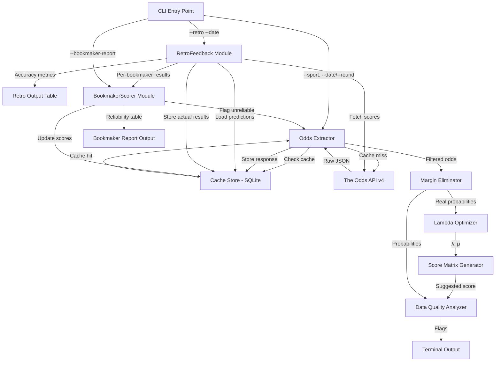

# Design Document: Betting Odds Calculator

## Overview

This design describes a single-entry-point Python script that extracts soccer betting odds from The Odds API (v4), removes bookmaker commission via configurable margin elimination methods, reverse-engineers Expected Goals (λ and μ) using scipy optimization against a Poisson model, and outputs the most probable exact score per match in a strictly numeric terminal table.

The script operates as a pure CLI tool with no server component. It caches raw API responses in a local SQLite database to conserve API credits and supports execution by date or by league round.

### Key Design Decisions

1. **Independent Poisson model**: Goals are modeled as independent Poisson random variables (not bivariate with correlation parameter). This simplifies optimization to two parameters (λ, μ) while remaining standard for market-derived expected goals.
2. **Shin method as default**: The Shin method accounts for favourite-longshot bias present in bookmaker odds, producing more accurate true probabilities than simple normalization.
3. **Per-bookmaker processing with aggregation**: Each bookmaker's odds are independently de-vigged, then the median real probability across bookmakers is used for optimization. This reduces noise from any single bookmaker.
4. **L-BFGS-B optimizer**: Bounded optimization method from scipy that handles the [0.1, 5.0] constraints on λ and μ natively without requiring penalty terms.

## Architecture



### Processing Pipeline

Each match flows through a sequential pipeline:
1. **Extraction** → fetch/cache odds from API
2. **Margin Elimination** → convert raw odds to real probabilities per bookmaker
3. **Aggregation** → compute median probabilities across bookmakers
4. **Optimization** → fit λ and μ via scipy.optimize.minimize
5. **Score Matrix** → generate 6×6 Poisson grid, select max-probability cell
6. **Quality Flags** → compute variance, margin, and coverage indicators
7. **Output** → render pipe-delimited table row

Matches that fail at any step are skipped (logged to stderr) and omitted from output.

## Components and Interfaces

### 1. CLI Module (`main.py`)

Entry point that parses arguments and orchestrates the pipeline.

```python
def main():
    """
    Parse CLI arguments and run the processing pipeline.
    
    Arguments:
        --sport: Required. Sport/league key (e.g., "soccer_epl")
        --date: Optional. Date in YYYY-MM-DD format
        --round: Optional. League round identifier
        --method: Optional. Margin removal method ("shin" | "logarithmic"), default "shin"
        --ttl: Optional. Cache TTL in hours (1-48), default 24
        --bookmakers: Optional. Comma-separated bookmaker keys to filter
    """
```

### 2. Odds Extractor (`odds_extractor.py`)

Responsible for fetching odds from The Odds API v4 and managing cache interactions.

```python
class OddsExtractor:
    BASE_URL = "https://api.the-odds-api.com/v4"
    TIMEOUT = 30  # seconds
    
    def __init__(self, api_key: str, cache_store: CacheStore, ttl_hours: int = 24):
        ...

    def fetch_odds(self, sport: str, markets: list[str], 
                   bookmakers: list[str] | None = None,
                   commence_time_from: str | None = None,
                   commence_time_to: str | None = None) -> list[dict]:
        """
        Fetch odds from API or cache. Returns list of event dicts.
        
        Raises OddsExtractionError on HTTP errors or timeouts.
        """
    
    def _build_request_params(self, sport: str, markets: list[str],
                               bookmakers: list[str] | None,
                               commence_time_from: str | None,
                               commence_time_to: str | None) -> dict:
        """Build query parameters for The Odds API v4 GET /odds endpoint."""
    
    def _filter_events(self, events: list[dict], 
                       min_bookmakers: int = 3) -> list[dict]:
        """
        Filter events ensuring each has both h2h and totals markets
        from at least min_bookmakers. Logs warnings for skipped matches.
        """
```

### 3. Cache Store (`cache_store.py`)

SQLite-backed cache that stores raw JSON responses.

```python
class CacheStore:
    def __init__(self, db_path: str = "odds_cache.db"):
        ...
    
    def get(self, sport_key: str, market_type: str, 
            event_id: str, bookmaker_keys: tuple[str, ...]) -> dict | None:
        """
        Return cached response if exists and not expired.
        Returns None if no valid cache entry.
        """
    
    def put(self, sport_key: str, market_type: str, event_id: str,
            bookmaker_keys: tuple[str, ...], response_json: str,
            retrieved_at: datetime) -> None:
        """Store raw JSON response with metadata."""
    
    def is_expired(self, retrieved_at: datetime, ttl_hours: int) -> bool:
        """Check if cached entry exceeds TTL threshold."""
```

**SQLite Schema:**

```sql
CREATE TABLE IF NOT EXISTS cache (
    id INTEGER PRIMARY KEY AUTOINCREMENT,
    sport_key TEXT NOT NULL,
    market_type TEXT NOT NULL,
    event_id TEXT NOT NULL,
    bookmaker_keys TEXT NOT NULL,  -- JSON array of sorted bookmaker keys
    response_json TEXT NOT NULL,
    retrieved_at TEXT NOT NULL,    -- ISO 8601 UTC timestamp
    UNIQUE(sport_key, market_type, event_id, bookmaker_keys)
);

CREATE INDEX idx_cache_lookup 
ON cache(sport_key, market_type, event_id, bookmaker_keys);
```

### 4. Margin Eliminator (`margin_eliminator.py`)

Removes bookmaker overround to produce real probabilities.

```python
class MarginEliminator:
    def __init__(self, method: str = "shin"):
        """method: 'shin' or 'logarithmic'"""
    
    def eliminate(self, decimal_odds: tuple[float, float, float]) -> tuple[float, float, float]:
        """
        Convert 1X2 decimal odds to real probabilities.
        
        Args:
            decimal_odds: (home_odd, draw_odd, away_odd)
        
        Returns:
            (p_home, p_draw, p_away) summing to 1.0 (±0.001)
        
        Raises:
            AnomalousOddsError if implied probabilities sum <= 1.0
        """
    
    def _shin_method(self, implied_probs: tuple[float, float, float]) -> tuple[float, float, float]:
        """
        Shin's method: solve for z (proportion of insider trading)
        then compute true probabilities accounting for favourite-longshot bias.
        
        For n outcomes with implied probabilities p_i summing to S:
        z = (S - 1) / (S - 1 + n)  [simplified 3-outcome approximation]
        true_p_i = (sqrt(z² + 4*(1-z) * p_i² / S) - z) / (2*(1-z))
        """
    
    def _logarithmic_method(self, implied_probs: tuple[float, float, float]) -> tuple[float, float, float]:
        """
        Logarithmic normalization: distribute overround proportionally.
        
        true_p_i = (p_i ^ k) / sum(p_j ^ k)
        where k is found such that sum equals 1.0.
        Equivalent to normalizing in log-odds space.
        """
```

### 5. Lambda Optimizer (`lambda_optimizer.py`)

Fits expected goals parameters using scipy optimization.

```python
class LambdaOptimizer:
    INITIAL_GUESS = (1.5, 1.2)
    BOUNDS = ((0.1, 5.0), (0.1, 5.0))
    CONVERGENCE_THRESHOLD = 1e-6
    
    def optimize(self, real_probs_1x2: tuple[float, float, float],
                 real_prob_over_2_5: float) -> tuple[float, float] | None:
        """
        Find λ (home xG) and μ (away xG) that minimize the sum of squared
        differences between Poisson-predicted and real probabilities.
        
        Objective function:
            f(λ, μ) = (P_home_poisson - p_home)²
                     + (P_draw_poisson - p_draw)²
                     + (P_away_poisson - p_away)²
                     + (P_over_2.5_poisson - p_over)²
        
        Returns (λ, μ) rounded to 4 decimal places, or None on failure.
        """
    
    def _poisson_1x2(self, lam: float, mu: float, 
                     max_goals: int = 10) -> tuple[float, float, float]:
        """
        Calculate P(home win), P(draw), P(away win) from independent
        Poisson distributions with parameters λ and μ.
        
        Sums over i,j from 0 to max_goals:
        - P(home) = sum of P(X=i)*P(Y=j) where i > j
        - P(draw) = sum of P(X=i)*P(Y=j) where i == j
        - P(away) = sum of P(X=i)*P(Y=j) where i < j
        """
    
    def _poisson_over_2_5(self, lam: float, mu: float, 
                          max_goals: int = 10) -> float:
        """
        Calculate P(total goals > 2.5) from independent Poisson.
        
        P(over 2.5) = 1 - sum of P(X=i)*P(Y=j) where i+j <= 2
        """
```

### 6. Score Matrix Generator (`score_matrix.py`)

Generates probability grid and selects most probable exact score.

```python
class ScoreMatrixGenerator:
    MAX_GOALS = 5  # 0 to 5 inclusive → 6x6 grid
    
    def generate(self, lam: float, mu: float) -> dict:
        """
        Returns:
            {
                "matrix": list[list[float]],  # 6x6 probability grid
                "suggested_score": (int, int),  # (home_goals, away_goals)
                "score_probability": float      # probability as fraction
            }
        """
    
    def _select_max_cell(self, matrix: list[list[float]]) -> tuple[int, int]:
        """
        Select cell with highest probability.
        Tiebreaker 1: lowest total goals (home + away).
        Tiebreaker 2: fewer home goals.
        """
```

### 7. Data Quality Analyzer (`data_quality.py`)

Computes quality flags for each match.

```python
class DataQualityAnalyzer:
    VARIANCE_THRESHOLD = 0.03
    HIGH_MARGIN_THRESHOLD = 0.10
    LOW_COVERAGE_THRESHOLD = 3
    
    def analyze(self, match_odds: dict) -> dict:
        """
        Returns:
            {
                "variance_flag": float,    # max std dev across 1X2 outcomes, 0.00 if below threshold
                "high_margin": float,      # max overround across bookmakers, 0.00 if below threshold
                "low_coverage": int        # number of bookmakers, 0 if >= threshold
            }
        """
    
    def _compute_std_dev(self, bookmaker_probs: list[tuple[float, float, float]]) -> float:
        """Compute max standard deviation across home/draw/away implied probs."""
    
    def _compute_overround(self, decimal_odds: tuple[float, float, float]) -> float:
        """Compute overround as sum of implied probabilities minus 1.0."""
```

### 8. Terminal Output (`output.py`)

Renders the pipe-delimited results table.

```python
class TerminalOutput:
    COLUMNS = [
        "Match", "Real Home Prob %", "Real Draw Prob %", "Real Away Prob %",
        "xG Home (λ)", "xG Away (μ)", "Suggested Score", "Score Prob %",
        "Variance Flag", "High Margin", "Low Coverage"
    ]
    
    def render(self, results: list[dict]) -> str:
        """
        Produce pipe-delimited table string with header and data rows.
        All values strictly numeric (no text labels).
        Flag columns show 0.00 or empty when not triggered.
        """
```

### 9. RetroFeedback Module (`retro_feedback.py`)

Fetches actual match scores after matchday, compares against stored predictions, and computes accuracy metrics.

```python
class RetroFeedback:
    def __init__(self, api_key: str, cache_store: CacheStore):
        ...

    def run(self, date: str) -> RetroReport:
        """
        Execute retro-feedback for a given date.
        
        1. Load predictions stored for that date from SQLite
        2. Fetch actual scores from The Odds API scores endpoint
        3. Store actual results in actual_results table
        4. Compute per-match accuracy metrics
        5. Compute aggregate metrics
        
        Returns RetroReport with per-match and aggregate data.
        """

    def fetch_actual_scores(self, sport: str, date: str) -> list[dict]:
        """
        Fetch completed match scores from The Odds API scores endpoint.
        
        Raises OddsExtractionError on HTTP errors or timeouts.
        """

    def compare_prediction(self, prediction: dict, actual: dict) -> MatchComparison:
        """
        Compare a single prediction against actual result.
        
        Returns:
            MatchComparison with:
                - x1x2_correct: bool (predicted outcome matches actual)
                - score_correct: bool (exact score matches)
                - lambda_error: float (|predicted_lambda - actual_home_goals|)
                - mu_error: float (|predicted_mu - actual_away_goals|)
        """

    def compute_aggregates(self, comparisons: list[MatchComparison]) -> AggregateMetrics:
        """
        Compute aggregate accuracy metrics across all comparisons.
        
        Returns:
            AggregateMetrics with:
                - x1x2_hit_rate: float (percentage)
                - score_hit_rate: float (percentage)
                - mean_lambda_error: float
                - mean_mu_error: float
        """

    def render_retro_table(self, comparisons: list[MatchComparison], 
                           aggregates: AggregateMetrics) -> str:
        """
        Render pipe-delimited retro-feedback table.
        Columns: Match | Predicted Score | Actual Score | 1X2 Correct | 
                 Score Correct | λ Error | μ Error | Bookmaker Source
        
        Appends aggregate row at bottom.
        All values strictly numeric.
        """
```

### 10. BookmakerScorer Module (`bookmaker_scorer.py`)

Maintains per-bookmaker reliability scores over time, flags unreliable bookmakers, and provides reporting.

```python
class BookmakerScorer:
    DEFAULT_THRESHOLD = 0.30

    def __init__(self, cache_store: CacheStore, threshold: float = 0.30):
        ...

    def update_scores(self, comparisons: list[MatchComparison]) -> None:
        """
        Update bookmaker_scores table with results from a retro-feedback run.
        
        For each bookmaker referenced in comparisons:
        - Increment total_matches
        - Increment correct_1x2 if prediction was correct
        - Update running mean for lambda_error and mu_error
        """

    def compute_reliability_score(self, stats: BookmakerStats) -> float:
        """
        Compute reliability score using weighted formula:
        score = 0.5 * hit_rate + 0.25 * (1 - norm_lambda_err) + 0.25 * (1 - norm_mu_err)
        
        Where normalized errors are scaled to [0, 1] relative to the 
        worst-performing bookmaker in the current dataset.
        
        Returns float in [0.0, 1.0].
        """

    def flag_unreliable(self) -> list[str]:
        """
        Check all bookmakers against threshold.
        Flag those with reliability_score < threshold as unreliable.
        Returns list of newly flagged bookmaker keys.
        """

    def get_excluded_bookmakers(self) -> list[str]:
        """
        Return list of bookmaker keys currently flagged as unreliable.
        These should be excluded from odds processing.
        """

    def enable_bookmaker(self, bookmaker_key: str) -> bool:
        """
        Manually re-enable a flagged bookmaker.
        Returns True if bookmaker was found and re-enabled, False otherwise.
        """

    def render_report(self) -> str:
        """
        Render pipe-delimited bookmaker reliability report.
        Columns: Bookmaker | Matches | 1X2 Hit Rate % | Mean λ Error | 
                 Mean μ Error | Reliability Score | Status
        
        All values strictly numeric. Status: 1 = active, 0 = excluded.
        """
```

## Data Models

### API Response Model (from The Odds API v4)

```python
@dataclass
class OddsEvent:
    id: str
    sport_key: str
    commence_time: str  # ISO 8601
    home_team: str
    away_team: str
    bookmakers: list[BookmakerOdds]

@dataclass
class BookmakerOdds:
    key: str
    title: str
    last_update: str
    markets: list[Market]

@dataclass
class Market:
    key: str  # "h2h" or "totals"
    outcomes: list[Outcome]

@dataclass
class Outcome:
    name: str
    price: float  # decimal odds
    point: float | None = None  # for totals (2.5)
```

### Internal Processing Models

```python
@dataclass
class MatchResult:
    home_team: str
    away_team: str
    real_probs: tuple[float, float, float]  # (home, draw, away)
    lambda_home: float
    mu_away: float
    suggested_score: tuple[int, int]
    score_probability: float
    variance_flag: float
    high_margin: float
    low_coverage: int

@dataclass
class CacheEntry:
    sport_key: str
    market_type: str
    event_id: str
    bookmaker_keys: str  # JSON array string
    response_json: str
    retrieved_at: str  # ISO 8601 UTC
```

### Configuration Model

```python
@dataclass
class Config:
    api_key: str               # from environment variable ODDS_API_KEY
    sport: str                 # e.g., "soccer_epl"
    date: str | None           # YYYY-MM-DD or None
    round_id: str | None       # round identifier or None
    method: str                # "shin" or "logarithmic"
    ttl_hours: int             # 1-48, default 24
    bookmakers: list[str] | None  # filter list or None for API default
    db_path: str               # SQLite file path, default "odds_cache.db"
    retro_mode: bool           # True if --retro flag is set
    bookmaker_report: bool     # True if --bookmaker-report flag is set
    enable_bookmaker: str | None  # bookmaker key to re-enable, or None
    reliability_threshold: float  # default 0.30
```

### RetroFeedback Models

```python
@dataclass
class MatchComparison:
    home_team: str
    away_team: str
    predicted_score: tuple[int, int]
    actual_score: tuple[int, int]
    predicted_lambda: float
    predicted_mu: float
    x1x2_correct: bool       # 1X2 outcome matches
    score_correct: bool       # exact score matches
    lambda_error: float       # |predicted_lambda - actual_home_goals|
    mu_error: float           # |predicted_mu - actual_away_goals|
    bookmaker_source: str     # bookmaker key used for this prediction

@dataclass
class AggregateMetrics:
    x1x2_hit_rate: float      # percentage (0-100)
    score_hit_rate: float     # percentage (0-100)
    mean_lambda_error: float
    mean_mu_error: float

@dataclass
class BookmakerStats:
    bookmaker_key: str
    total_matches: int
    correct_1x2: int
    mean_lambda_error: float
    mean_mu_error: float
    reliability_score: float
    is_active: bool           # False if flagged as unreliable
```

### RetroFeedback SQLite Schema

```sql
CREATE TABLE IF NOT EXISTS predictions (
    id INTEGER PRIMARY KEY AUTOINCREMENT,
    sport_key TEXT NOT NULL,
    event_id TEXT NOT NULL,
    home_team TEXT NOT NULL,
    away_team TEXT NOT NULL,
    predicted_home_goals INTEGER NOT NULL,
    predicted_away_goals INTEGER NOT NULL,
    lambda_home REAL NOT NULL,
    mu_away REAL NOT NULL,
    bookmaker_source TEXT NOT NULL,
    prediction_date TEXT NOT NULL,     -- YYYY-MM-DD
    created_at TEXT NOT NULL,          -- ISO 8601 UTC timestamp
    UNIQUE(sport_key, event_id, bookmaker_source)
);

CREATE INDEX idx_predictions_date 
ON predictions(sport_key, prediction_date);

CREATE TABLE IF NOT EXISTS actual_results (
    id INTEGER PRIMARY KEY AUTOINCREMENT,
    sport_key TEXT NOT NULL,
    event_id TEXT NOT NULL,
    home_team TEXT NOT NULL,
    away_team TEXT NOT NULL,
    home_goals INTEGER NOT NULL,
    away_goals INTEGER NOT NULL,
    match_date TEXT NOT NULL,          -- YYYY-MM-DD
    retrieved_at TEXT NOT NULL,        -- ISO 8601 UTC timestamp
    UNIQUE(sport_key, event_id)
);

CREATE INDEX idx_actual_results_date 
ON actual_results(sport_key, match_date);

CREATE TABLE IF NOT EXISTS bookmaker_scores (
    id INTEGER PRIMARY KEY AUTOINCREMENT,
    bookmaker_key TEXT NOT NULL UNIQUE,
    total_matches INTEGER NOT NULL DEFAULT 0,
    correct_1x2 INTEGER NOT NULL DEFAULT 0,
    sum_lambda_error REAL NOT NULL DEFAULT 0.0,
    sum_mu_error REAL NOT NULL DEFAULT 0.0,
    reliability_score REAL NOT NULL DEFAULT 1.0,
    is_active INTEGER NOT NULL DEFAULT 1,  -- 1 = active, 0 = excluded
    last_updated TEXT NOT NULL             -- ISO 8601 UTC timestamp
);

CREATE INDEX idx_bookmaker_scores_active 
ON bookmaker_scores(is_active);
```


## Correctness Properties

*A property is a characteristic or behavior that should hold true across all valid executions of a system — essentially, a formal statement about what the system should do. Properties serve as the bridge between human-readable specifications and machine-verifiable correctness guarantees.*

### Property 1: Cache Store Round-Trip

*For any* valid JSON response string and associated metadata (sport key, market type, event ID, bookmaker keys), storing it in the Cache Store and then retrieving it with the same lookup keys SHALL return an identical JSON string.

**Validates: Requirements 1.7, 2.1, 2.3**

### Property 2: Cache TTL Invalidation

*For any* cache entry with a known `retrieved_at` timestamp and *for any* TTL value between 1 and 48 hours, the entry SHALL be considered expired if and only if the current time minus `retrieved_at` exceeds the configured TTL.

**Validates: Requirements 2.4**

### Property 3: Cache Hit Prevents API Call

*For any* request whose parameters (sport key, market type, event ID, bookmaker keys) match a non-expired cache entry, the system SHALL return the cached data without making an HTTP request to The Odds API.

**Validates: Requirements 2.2**

### Property 4: Margin Elimination Sum-to-One Invariant

*For any* set of three decimal odds (home, draw, away) where the sum of their reciprocals exceeds 1.0, applying the Margin Eliminator SHALL produce three real probabilities that sum to 1.0 within a tolerance of ±0.001.

**Validates: Requirements 3.2, 3.3**

### Property 5: Margin Elimination Output Range

*For any* set of valid decimal odds with overround > 0, each individual real probability produced by the Margin Eliminator SHALL be within the range [0.0, 1.0] inclusive.

**Validates: Requirements 3.6**

### Property 6: Anomalous Odds Exclusion

*For any* set of three decimal odds where the sum of their reciprocals (implied probabilities) is less than or equal to 1.0, the Margin Eliminator SHALL reject those odds and exclude the bookmaker from processing.

**Validates: Requirements 3.5**

### Property 7: Optimization Round-Trip

*For any* λ in [0.1, 5.0] and μ in [0.1, 5.0], computing the Poisson-predicted 1X2 probabilities and Over 2.5 probability from those parameters, then running the Lambda Optimizer on those probabilities, SHALL recover λ and μ within a tolerance of 0.05.

**Validates: Requirements 4.1, 4.2**

### Property 8: Optimization Bounds Constraint

*For any* set of valid real probabilities provided to the Lambda Optimizer, if optimization succeeds, the returned λ and μ SHALL both be within the range [0.1, 5.0].

**Validates: Requirements 4.6**

### Property 9: Score Matrix Structure and Correctness

*For any* λ in (0, 5.0] and μ in (0, 5.0], the Score Matrix Generator SHALL produce a 6×6 matrix where each cell (i, j) equals `poisson_pmf(i, λ) × poisson_pmf(j, μ)` within floating-point tolerance.

**Validates: Requirements 5.1, 5.2**

### Property 10: Score Matrix Argmax with Tiebreaker

*For any* 6×6 probability matrix, the selected suggested score SHALL be the cell with the maximum probability. If multiple cells share the maximum, the selected cell SHALL have the lowest total goals (i+j), and if still tied, the fewer home goals (i).

**Validates: Requirements 5.3, 5.4**

### Property 11: Output Contains Only Numeric Values

*For any* set of MatchResult objects rendered to the terminal table, the output string SHALL not contain any qualitative text descriptors (words such as "high", "medium", "low", "good", "bad", "strong", "weak").

**Validates: Requirements 6.7, 8.6**

### Property 12: Only Successful Matches Appear in Output

*For any* set of matches where some fail during processing and some succeed, the output table SHALL contain exactly one row per successful match and zero rows for failed matches.

**Validates: Requirements 6.8**

### Property 13: Date Filtering Correctness

*For any* set of events with varying `commence_time` values and a given target date, the system SHALL process only events whose `commence_time` falls within that target date (00:00:00 to 23:59:59 UTC).

**Validates: Requirements 7.2**

### Property 14: Standard Deviation Computation

*For any* list of bookmaker implied probability sets (each a tuple of 3 values), the computed standard deviation for each outcome position SHALL equal the population standard deviation of that position's values across all bookmakers.

**Validates: Requirements 8.1**

### Property 15: Variance Flag Threshold

*For any* match where the maximum standard deviation across the three 1X2 outcome probabilities exceeds 0.03, the Variance Flag SHALL be set to that maximum value. If the maximum is ≤ 0.03, the flag SHALL be 0.00.

**Validates: Requirements 8.2**

### Property 16: Overround Computation

*For any* set of three decimal odds, the computed overround SHALL equal the sum of their reciprocals minus 1.0.

**Validates: Requirements 8.3**

### Property 17: High Margin Flag Threshold

*For any* match where any bookmaker's overround exceeds 0.10, the High Margin flag SHALL be set to the maximum overround value across all bookmakers. If no bookmaker exceeds 0.10, the flag SHALL be 0.00.

**Validates: Requirements 8.4**

### Property 18: Retro-Feedback Accuracy Computation

*For any* predicted score (home_pred, away_pred) with predicted λ and μ, and *for any* actual score (home_actual, away_actual), the system SHALL correctly compute: (a) 1X2 correctness as whether the predicted outcome sign matches the actual outcome sign, (b) exact score correctness as whether predicted equals actual, and (c) λ error as |λ - home_actual| and μ error as |μ - away_actual|.

**Validates: Requirements 9.3**

### Property 19: Aggregate Metrics Correctness

*For any* non-empty list of match comparisons, the aggregate 1X2 hit rate SHALL equal (count of x1x2_correct=True / total matches) × 100, the exact score hit rate SHALL equal (count of score_correct=True / total matches) × 100, the mean λ error SHALL equal the arithmetic mean of all individual λ errors, and the mean μ error SHALL equal the arithmetic mean of all individual μ errors.

**Validates: Requirements 9.5**

### Property 20: Retro-Feedback Output Contains Only Numeric Values

*For any* set of match comparisons rendered to the retro-feedback table, the output string SHALL not contain any qualitative text descriptors and all accuracy values SHALL be represented as numeric values (1/0 for boolean, decimal for errors, percentage for rates).

**Validates: Requirements 9.4, 9.6**

### Property 21: Bookmaker Statistics Accumulation

*For any* sequence of retro-feedback runs attributed to a bookmaker, the accumulated total_matches SHALL equal the count of all match results processed, correct_1x2 SHALL equal the count of correct predictions, and mean errors SHALL equal sum of individual errors divided by total_matches.

**Validates: Requirements 10.2**

### Property 22: Reliability Score Formula and Threshold Flagging

*For any* bookmaker with a 1X2 hit rate in [0, 1], normalized λ error in [0, 1], and normalized μ error in [0, 1], the reliability score SHALL equal `0.5 * hit_rate + 0.25 * (1 - norm_lambda_error) + 0.25 * (1 - norm_mu_error)`, and the bookmaker SHALL be flagged as unreliable if and only if this score is strictly less than the configured threshold.

**Validates: Requirements 10.3, 10.4**

### Property 23: Bookmaker Report Output Contains Only Numeric Values

*For any* set of bookmaker statistics rendered to the bookmaker report table, the output string SHALL not contain qualitative text descriptors, and all values SHALL be strictly numeric (including Status as 1 for active, 0 for excluded).

**Validates: Requirements 10.5, 10.7**

## Error Handling

### HTTP Errors and Timeouts

| Scenario | Behavior |
|----------|----------|
| API timeout (>30s) | Log error with "TIMEOUT" indicator, cease processing for that request |
| HTTP 4xx | Log error with status code, cease processing |
| HTTP 5xx | Log error with status code, cease processing |
| Network error | Log error with exception message, cease processing |

No partial data is persisted on any HTTP failure.

### Cache Failures

| Scenario | Behavior |
|----------|----------|
| SQLite database locked | Retry up to 3 times with 1-second backoff, then proceed without cache |
| Corrupt database file | Log warning, create fresh database, proceed without cached data |
| Fresh fetch fails on expired entry | Return stale cached data with `[STALE]` warning to stderr |

### Processing Failures

| Scenario | Behavior |
|----------|----------|
| Anomalous odds (overround ≤ 0) | Exclude bookmaker for that match, log to stderr |
| Fewer than 3 valid bookmakers after filtering | Skip match, log warning |
| Optimizer non-convergence | Skip match, log match ID and "CONVERGENCE FAILED" to stderr |
| Optimizer objective ≥ 1e-6 | Skip match, log match ID and objective value to stderr |
| λ or μ non-positive | Skip match (should not occur with bounds, defensive check) |

### Input Validation

| Scenario | Behavior |
|----------|----------|
| Missing `--sport` argument | Print usage message, exit with code 1 |
| Invalid date format | Print "Invalid date format. Use YYYY-MM-DD.", exit with code 1 |
| Missing `ODDS_API_KEY` env var | Print "ODDS_API_KEY environment variable not set.", exit with code 1 |
| TTL outside [1, 48] range | Print "TTL must be between 1 and 48 hours.", exit with code 1 |
| Unknown margin method | Print "Method must be 'shin' or 'logarithmic'.", exit with code 1 |

### RetroFeedback Failures

| Scenario | Behavior |
|----------|----------|
| No predictions found for date | Print "No predictions found for date YYYY-MM-DD.", exit with code 0 |
| Scores API fails | Log error, report which matches could not be compared |
| Actual score not yet available | Skip match, log warning indicating match may not be completed |
| Bookmaker not found for --enable-bookmaker | Print "Bookmaker key not found.", exit with code 1 |
| Division by zero in aggregates (0 matches) | Return 0.0 for all rates and means |

## Testing Strategy

### Unit Tests (example-based)

Unit tests focus on specific scenarios, edge cases, and integration points:

- **CLI argument parsing**: Valid/invalid arguments, defaults, missing required args
- **HTTP error handling**: Mock 4xx, 5xx, timeout scenarios
- **Shin method correctness**: Known odds → known true probabilities (from literature)
- **Logarithmic method correctness**: Known odds → known true probabilities
- **Optimizer with degenerate input**: Probabilities that cause non-convergence
- **Tiebreaker edge case**: Matrix with multiple cells at same max probability
- **Stale cache fallback**: Expired cache + API failure → stale data returned
- **Output column order**: Verify exact column sequence matches specification

### Property-Based Tests (universal properties)

Property-based tests verify universal properties across randomly generated inputs. Each property test runs a minimum of **100 iterations** using the `hypothesis` library.

**Library**: [hypothesis](https://hypothesis.readthedocs.io/) (Python property-based testing framework)

**Configuration**:
```python
from hypothesis import settings, given
from hypothesis import strategies as st

@settings(max_examples=100)
```

**Tag format for each test**:
```python
# Feature: betting-odds-calculator, Property {N}: {property_text}
```

**Properties to implement**:

| Property | Module Under Test | Key Generators |
|----------|-------------------|----------------|
| 1: Cache round-trip | `cache_store.py` | Random JSON strings, sport keys, event IDs |
| 2: Cache TTL invalidation | `cache_store.py` | Random timestamps, TTL values 1-48 |
| 3: Cache hit prevents API call | `odds_extractor.py` | Random cached entries, matching requests |
| 4: Sum-to-one invariant | `margin_eliminator.py` | Random decimal odds triplets (each > 1.0, sum of reciprocals > 1.0) |
| 5: Output range [0,1] | `margin_eliminator.py` | Same generator as Property 4 |
| 6: Anomalous odds exclusion | `margin_eliminator.py` | Odds where sum of reciprocals ≤ 1.0 |
| 7: Optimization round-trip | `lambda_optimizer.py` | Random λ ∈ [0.3, 4.0], μ ∈ [0.3, 4.0] |
| 8: Optimization bounds | `lambda_optimizer.py` | Random valid probability tuples |
| 9: Score matrix structure | `score_matrix.py` | Random λ, μ ∈ (0, 5.0] |
| 10: Argmax with tiebreaker | `score_matrix.py` | Random 6×6 probability matrices |
| 11: Numeric-only output | `output.py` | Random MatchResult sets |
| 12: Successful matches only | `output.py` | Mixed success/failure match sets |
| 13: Date filtering | `odds_extractor.py` | Random events with random dates, target date |
| 14: Std dev computation | `data_quality.py` | Random bookmaker probability lists |
| 15: Variance flag threshold | `data_quality.py` | Random probability sets with varying std devs |
| 16: Overround computation | `data_quality.py` | Random decimal odds triplets |
| 17: High margin flag | `data_quality.py` | Random odds with varying overrounds |
| 18: Retro accuracy computation | `retro_feedback.py` | Random predicted/actual score pairs, random λ/μ values |
| 19: Aggregate metrics | `retro_feedback.py` | Random lists of MatchComparison objects |
| 20: Retro output numeric-only | `retro_feedback.py` | Random MatchComparison sets rendered to table |
| 21: Bookmaker stats accumulation | `bookmaker_scorer.py` | Random sequences of match results per bookmaker |
| 22: Reliability score & threshold | `bookmaker_scorer.py` | Random hit rates, normalized errors, thresholds |
| 23: Bookmaker report numeric-only | `bookmaker_scorer.py` | Random BookmakerStats sets rendered to table |

### Integration Tests

- **End-to-end with mocked API**: Full pipeline from CLI invocation through to terminal output using recorded API responses
- **SQLite persistence**: Verify cache file is created and survives script restart
- **API quota header tracking**: Verify `x-requests-remaining` is logged after each API call
- **Retro-feedback end-to-end**: Mock scores API, verify full comparison pipeline from stored predictions to output table
- **Bookmaker scoring persistence**: Run multiple retro sessions, verify bookmaker_scores table accumulates correctly
- **Bookmaker exclusion flow**: Flag a bookmaker via retro, verify it's excluded from subsequent odds fetches
- **Re-enable bookmaker flow**: Flag then re-enable a bookmaker, verify it's included again

### Test File Structure

```
tests/
├── test_cache_store.py          # Properties 1, 2, 3
├── test_margin_eliminator.py    # Properties 4, 5, 6
├── test_lambda_optimizer.py     # Properties 7, 8
├── test_score_matrix.py         # Properties 9, 10
├── test_output.py               # Properties 11, 12
├── test_odds_extractor.py       # Property 13
├── test_data_quality.py         # Properties 14, 15, 16, 17
├── test_retro_feedback.py       # Properties 18, 19, 20
├── test_bookmaker_scorer.py     # Properties 21, 22, 23
└── test_integration.py          # End-to-end tests
```
